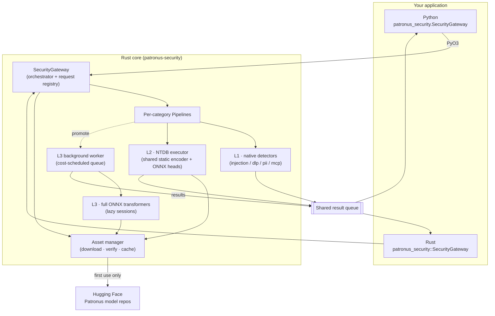
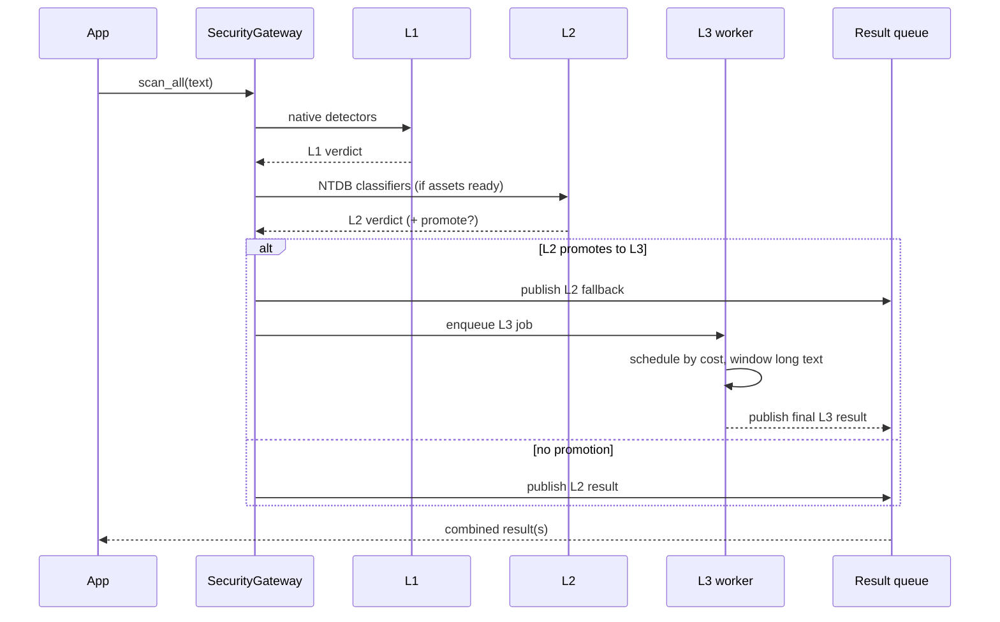

# Architecture

This page explains how Patronus Ark is put together — the major components, how a scan
flows through them, and why the design looks the way it does. For the moment-to-moment
escalation rules, see [Layered scanning](layered-scanning.md).

## The big picture

Patronus Ark is a **Rust core** with a thin **Python binding**. The core owns all
scanning logic, model execution, asset management, and the async worker; the Python layer is
a typed convenience wrapper over the same gateway object.

## Components

### SecurityGateway

The orchestrator and the only public entry point. It:

- holds the **configuration** (categories, `max_level`, L3 strategy, execution gates, backend);
- builds one **pipeline per category**;
- owns the **request registry** that tracks which scanners and promoted L3 jobs may still
  publish an event for a given request ID;
- exposes both a **synchronous** API (`scan_all`, `scan_category`, `scan_categories`) and an
  **asynchronous** API (`enqueue` + `consume_next_event`).

Construction is layered so you can separate a network-capable *asset-sync* phase from a
strictly-local *runtime-start* phase — see [Asset & runtime lifecycle](#asset-and-runtime-lifecycle).

### Pipelines

Each category owns a pipeline that knows which of L1/L2/L3 it supports and how to combine
their outputs into a single [result](../reference/result-schema.md). Some categories are
L1-only (`pii`), some are L3-only (`dynamic-pii`), most run L1→L2 with optional L3 promotion.
See [Categories](categories.md) for the per-category layer map.

### The three layers

| Layer | Implementation | Loaded | Latency class |
| --- | --- | --- | --- |
| **L1** | Native Rust detectors in `detectors/` and `threat/` | always | microseconds |
| **L2** | NTDB model packages executed by a shared static-embedding encoder | on warmup (if cached) | milliseconds |
| **L3** | Full ONNX transformer sessions | lazily, on first promotion | tens of milliseconds |

L1 and L2 run inline on the gateway worker. L3 runs in a **separate background worker** so a
heavy transformer never blocks a fast L1/L2 answer. Detailed escalation logic lives in
[Layered scanning](layered-scanning.md); the model formats live in
[Models & the NTDB format](models-and-ntdb.md).

### The L3 background worker

L3 is expensive, so it is decoupled from the request path:

- When L2 **promotes** a scan, the pipeline first publishes the **L2 fallback** result to the
  shared queue, then enqueues an L3 job.
- The worker **schedules by estimated and observed compute cost** (an exponentially weighted
  moving average of real execution time), applies a **max-wait guard** against starvation,
  and splits long texts into **tokenizer-bounded windows with token overlap**.
- L3 errors and timeouts **degrade back to the L2 result** where a fallback exists.
- Sessions are evicted only after a long idle TTL (`PATRONUS_L3_TTL_SECS`, default 300 s);
  the worker never hot-swaps models per request.

The worker can run **one dedicated model per category** or **one coalesced multi-head model**
for all categories — see the [`l3_strategy`](../reference/configuration.md#l3-strategy) knob
and [Performance](performance.md).

### The shared result queue

All results — synchronous or asynchronous, L1/L2 or L3 — are published to one shared queue
keyed by `request_id`. This is what lets a ready L2 result for request B overtake request A
that is still waiting for L3. In the async API you drain this queue with
`consume_next_event()`; in the sync API the gateway drains it for you.

### The asset manager

Native L1 needs no assets. L2/L3 scanners download **Patronus-owned model bundles** from the
Hugging Face repositories listed in [`rust/src/assets/specs.rs`](https://github.com/patronus-protect/patronus-security/blob/main/rust/src/assets/specs.rs).
The manager downloads on first use, verifies integrity by content/source hash, caches under
the platform cache directory (or a custom `model_dir`), and converts tokenizers into a compact
on-disk form once. See [Manage model assets](../how-to/manage-assets.md) and
[Assets](../assets.md).

## How a scan flows

A synchronous `scan_all(text)` for a category that supports all three layers:

## Asset and runtime lifecycle

For deployments that must not download during a delivery window, the lifecycle splits into
two phases:

1. **Asset-sync (network allowed).** `prepare_assets()` downloads and verifies everything the
   configured categories need.
2. **Runtime-start (strictly local).** `warmup_from_local_assets()` initializes pipelines
   from the local cache only, never touching the network.

`warmup()` remains a combined convenience call that does both. `asset_readiness()` /
`runtime_readiness()` inspect the local cache and initialized state **without** downloading or
loading models into memory. This is the recommended pattern for air-gapped and installer-based
deployments — see [Offline & air-gapped scanning](../how-to/offline-airgapped.md).

## Design principles

- **On-device first.** No scan content leaves the machine. The only network activity is the
  optional, one-time asset download from Hugging Face.
- **Pay for detection only when needed.** L1 resolves most traffic in microseconds; the
  transformer runs only for the uncertain minority that L2 promotes.
- **Rust core, thin bindings.** All logic lives once in Rust; Python (and any future binding)
  is a wrapper, so behavior cannot drift between languages.
- **Graceful degradation.** A missing asset, an L3 timeout, or an inference error degrades to
  the best available lower-layer result instead of failing the scan.
- **Reproducible assets.** Content/source hashes and converter versions invalidate stale
  generated files; local model overrides are never rewritten.
