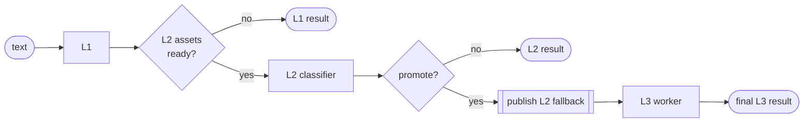

# Layered scanning (L1 / L2 / L3)

Patronus Ark scans each category with up to three layers. The layers escalate: cheap,
always-available checks run first, and expensive models run only for the traffic that earns
them. This page explains what each layer is, when the pipeline moves to the next one, and how
the layers combine into a single verdict.

## The three layers

### L1 — native detectors

Rule-based Rust detectors that need **no model assets** and run in **microseconds**. They are
always available, even fully offline. L1 covers deterministic and pattern-based risks:
prompt-injection phrasings, obfuscation tricks, secrets and destructive-operation patterns
(DLP), format-validated PII (email, IBAN, credit card, …), and MCP tool-policy checks.

L1 is the floor of every scan. See [Native detectors](detectors.md) for the full catalogue.

### L2 — NTDB model packages

Lightweight text classifiers in the Patronus **NTDB** format: the shared mmBERT tokenizer and
static embedder plus small ONNX heads and aggregators, packaged with a `manifest.json`. The
official L2 packages share this representation with compatible L3 models as well as with one
another, so adding categories is cheap and promotion does not start from raw text again. L2
answers in **milliseconds** and refines the L1 verdict with a learned classifier.

L2 promotion is decided by the NTDB package's promote-router. Separately, classifier verdicts
use a configurable final-decision threshold profile — see
[`ntdb_operating_point`](../reference/configuration.md#ntdb-operating-point).

### L3 — full ONNX transformers

Full transformer models (ModernBERT / mmBERT family), exported to ONNX and quantized. They
are the most accurate and the most expensive. Which L3 models a gateway holds is fixed by
configuration; they are kept **resident in RAM** (idle-TTL evicted) and executed by a
**background worker**, not on the request path. L3 answers in **tens of milliseconds** and
makes the final call for cases L2 could not resolve confidently.

For the current official mmBERT packages, L3 consumes the compatible token IDs already produced
for the selected L2 chunks. It therefore continues in the same tokenizer and embedding space;
there is no separate mmBERT tokenization step merely because a scan was promoted. Incompatible
local packages and windows that cannot be handed off safely fall back to L3's own tokenizer-bounded
planning.

## Escalation: how a scan moves up

1. **L1 always runs.** Its verdict is the guaranteed baseline.
2. **L2 runs when its assets are cached** and the level allows it (`max_level` ≥ L2). The L2
   classifier produces a refined verdict.
3. **Promotion to L3** happens when L2 is not confident enough to settle the case on its own
   and the level allows it (`max_level` = L3). The exact promotion behavior depends on the
   [operating point](../reference/configuration.md#ntdb-operating-point).
4. On promotion, the pipeline **immediately publishes the L2 fallback result**, then enqueues
   an L3 job. The **final L3 result is published later** by the worker.

Because the L2 fallback is published first, a caller always has a usable answer quickly, even
while the transformer is still running — and if L3 fails or times out, that fallback is what
remains.

## `max_level` is a hard ceiling

`max_level` (`"l1"`, `"l2"`, `"l3"`) is the highest layer the gateway may ever use. It caps
escalation regardless of anything else:

| `max_level` | L1 | L2 | L3 |
| --- | :---: | :---: | :---: |
| `l1` | ✅ | — | — |
| `l2` | ✅ | ✅ (if cached) | — |
| `l3` | ✅ | ✅ (if cached) | ✅ (if cached, on promotion) |

[Execution gates](../reference/configuration.md#execution-gates) can further disable
individual levels or specific detectors *below* the ceiling, per request, without changing it.

## Special pipelines

- **L1-only categories** (e.g. `pii`) never load models and never promote.
- **L3-only pipelines** (`dynamic-pii`) enqueue directly to the worker and publish only their
  completed result — there is no L1/L2 stage to fall back to.

See [Categories](categories.md) for each category's layer support.

## Long text and windowing

The L3 worker reuses compatible tokenized L2 windows and otherwise splits long inputs into
**tokenizer-bounded windows**. It aggregates the per-window outputs into one result and keeps memory
bounded so an attack buried deep in a long document is still caught. With representative
**clustering** enabled (off by default) it groups near-duplicate
windows by similarity, runs only cluster representatives, and propagates their verdict to the
rest, so most windows never reach the model; **early exit** stops a head once its aggregate can no
longer change. Aggregation strategy, clustering, and early exit are tunable per pipeline — see the
[L3 worker policy](../reference/configuration.md#l3-worker-policy). Window and chunk counts are
surfaced in the [local benchmark](../how-to/run-local-benchmark.md)'s load report.

## Degradation contract

Every failure path degrades to the best available result rather than throwing:

- **L2 assets missing** → return the L1 result.
- **L3 asset missing / not promoted** → return the L2 result.
- **L3 inference error or timeout** → return the published L2 fallback.

Failures are reported as structured `SecurityFailure` entries (stage + kind) on the terminal
event of the async API, so you can observe degradation without it breaking the scan. See the
[Result schema](../reference/result-schema.md).
