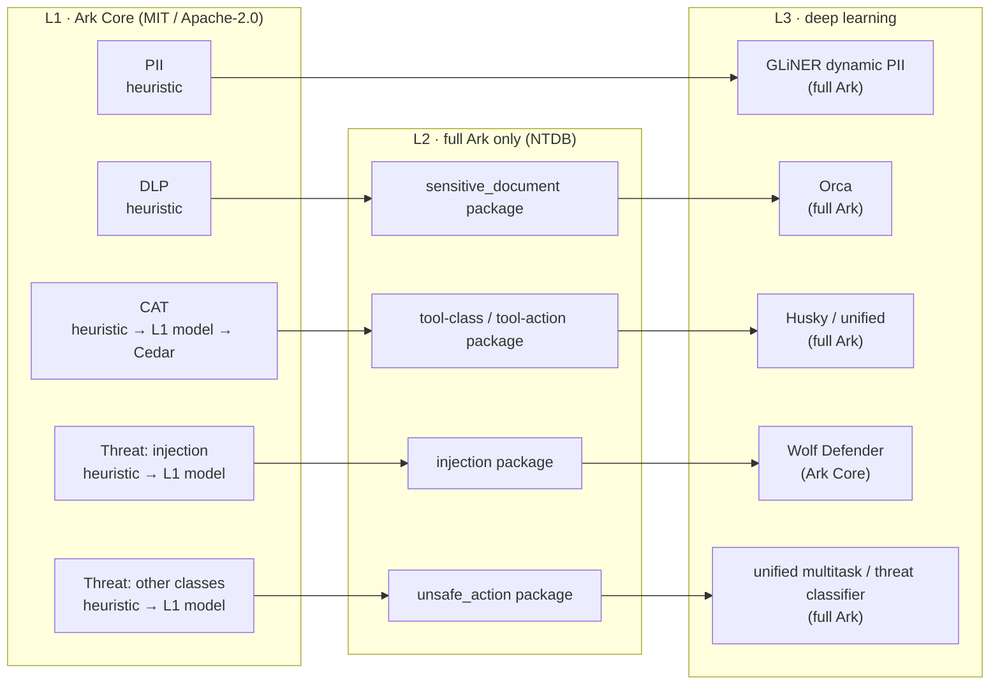
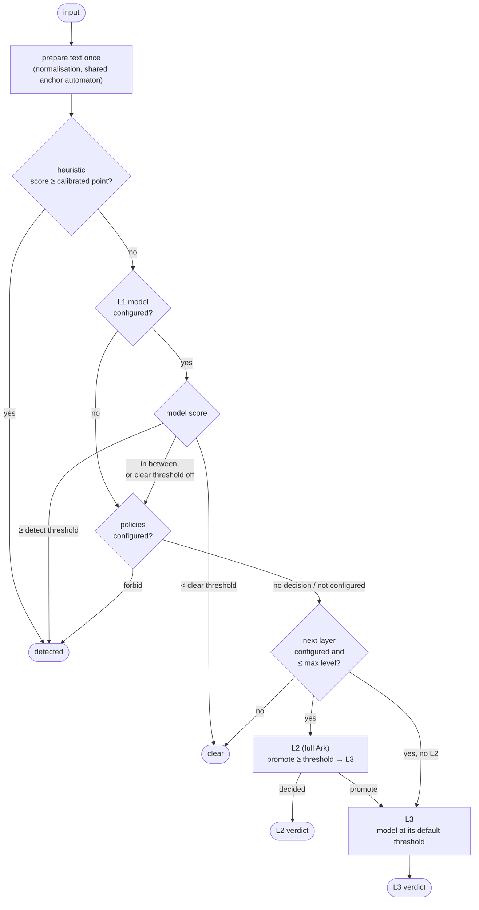
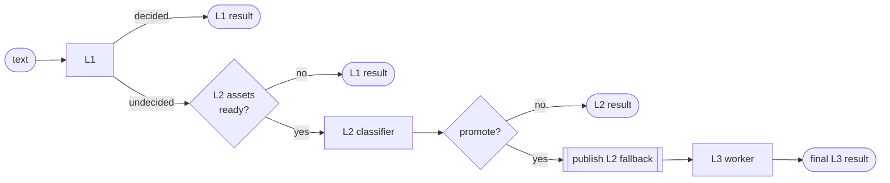

# Analysis framework: modules and layers

Patronus Ark analyses text with one framework in two dimensions: **analysis modules** (one per
category, the rows) and **layers** L1 → L2 → L3 (the columns, from cheap to expensive). Which
modules run, which layers they may use and every threshold are configuration. A later layer runs
only on what the earlier configured layers left undecided.

This is the single page for that model. [Architecture](architecture.md) describes the components
of the full Ark gateway; [Native detectors](detectors.md) catalogues the L1 rules.

## Glossary

Analysis module
:   One category's L1 unit in Ark Core: an anchor-based heuristic, an optional L1 model and
    optional policies over the module's results. Modules: PII, DLP, CAT (shell commands) and the
    threat classes (`injection`, `jailbreak`, `prompt_extraction`, `tool_poisoning`,
    `exfiltration`, `unsafe_action`, …).

Heuristic (anchor-based)
:   The rule stage of a module. Cheap literal anchors and prefilters decide whether a rule's
    pattern runs at all; matched rules are scored with points. A score at or above the calibrated
    point is **detected**.

L1 model
:   An optional small in-memory model per module (for example TF-IDF with logistic regression,
    or a fastText-style text model). It has two thresholds:
    the **detect threshold** (upper; a score at or above it is detected) and the
    **clear threshold** (lower; a score below it is clear). A score in between escalates. The
    clear threshold can be **switched off**: then the L1 model never clears, and everything below
    the detect threshold escalates.

Policies (Cedar)
:   Optional [Cedar](https://www.cedarpolicy.com/) policies evaluated over a module's results and
    facts, for example `forbid` → block, or ask. CAT uses them today with three tiers (core,
    bundle, user).

Facts
:   The structured, typed description a module derives from its input, which policies evaluate.
    CAT emits the `patronus.facts/1` schema for shell commands; text modules can get their own
    facts schema later.

Layers L1 / L2 / L3
:   **L1**: the analysis modules in Ark Core, tuned for high specificity (about 0.1 % false
    positives on benign data), so an L1 detection is very likely right. **L2**: NTDB model
    packages and their execution logic, full Ark only. **L3**: deep-learning models, in Ark Core
    (Wolf Defender) or full Ark only (unified multitask, Orca, Husky, Panther, GLiNER). Each L3
    model runs at its own default threshold.

Escalation
:   Handing an undecided input to the next configured stage or layer, together with the score,
    the threshold it was compared to, the evidence spans and the source stage.

Early exit
:   A stage that decides (detected or clear) ends the module's run; later stages and layers do
    not run for that input.

`StageOutcome`
:   What one stage says: `Detected`, `Clear` or `Escalate`.

`decided_by`
:   The stage that produced a module's verdict: `Heuristic`, `L1Model`, `Policy`, `L2` or `L3`.

Max level
:   `max_level` (`l1`, `l2`, `l3`) is the highest layer a run may use, a hard ceiling.

Conditional gates
:   Predicates (`all` / `any` / `not` over request metadata and the results of modules that
    already ran) that switch a layer on or off for one module and one request. See
    [conditional gates](../reference/configuration.md#conditional-gates).

## The grid: modules × layers

Each row is an analysis module, each column a layer. L1 has three stages inside the module.

```mermaid
flowchart LR
    subgraph L1["L1 · Ark Core (MIT / Apache-2.0)"]
        direction TB
        PII_H["PII<br/>heuristic"]
        DLP_H["DLP<br/>heuristic"]
        CAT_H["CAT<br/>heuristic → L1 model → Cedar"]
        INJ_H["Threat: injection<br/>heuristic → L1 model"]
        THR_H["Threat: other classes<br/>heuristic → L1 model"]
    end
    subgraph L2["L2 · full Ark only (NTDB)"]
        direction TB
        DLP_2["sensitive_document package"]
        CAT_2["tool-class / tool-action package"]
        INJ_2["injection package"]
        THR_2["unsafe_action package"]
    end
    subgraph L3["L3 · deep learning"]
        direction TB
        PII_3["GLiNER dynamic PII<br/>(full Ark)"]
        DLP_3["Orca<br/>(full Ark)"]
        CAT_3["Husky / unified<br/>(full Ark)"]
        INJ_3["Wolf Defender<br/>(Ark Core)"]
        THR_3["unified multitask / threat classifier<br/>(full Ark)"]
    end
    PII_H --> PII_3
    DLP_H --> DLP_2 --> DLP_3
    CAT_H --> CAT_2 --> CAT_3
    INJ_H --> INJ_2 --> INJ_3
    THR_H --> THR_2 --> THR_3
```

| Module | Heuristic (L1) | L1 model (L1) | Policies (L1) | L2 (full Ark, NTDB) | L3 |
| --- | --- | --- | --- | --- | --- |
| **PII** | anchors, validators, context, points (`pii_mode`, `rules`) | none yet; possible later | later, via a facts schema | none | GLiNER dynamic PII (full Ark) |
| **DLP** | anchors, rule keywords, value runs, points (`dlp_mode`, `rules`) | none yet; possible later | later, via a facts schema | Orca Sonar document package (`sensitive_document`) | Orca dedicated or unified (full Ark) |
| **CAT** (shell) | tokens and facts (`patronus.facts/1`) | TF-IDF / logistic regression, two thresholds (1 % and 0.1 % false positives) | Cedar, three tiers: core, bundle, user (`policy_dirs`, `cat.*` rules) | unified tool-class / tool-action package | Husky or unified (full Ark) |
| **Threat: injection** | rule catalog and families behind the anchor gate (`injection_mode`) | text model, two thresholds: detect at 0.1 %, clear at 1 % false positives; clear switchable off | later, via text facts | injection package (published in the Wolf Defender small repository) | Wolf Defender base / small / edge (Ark Core, default threshold) |
| **Threat: other classes** (`jailbreak`, `prompt_extraction`, `tool_poisoning`, `exfiltration`, `unsafe_action`, …) | class rules behind the anchor gate, points (`<class>_mode`) | text model per class, two thresholds, where it measures better | later, via text facts | unified threat package (`unsafe_action` only) | unified multitask or threat classifier (full Ark) |

The L2 injection package is an NTDB L2 model; it only shares a repository with Wolf Defender.
Wolf Defender itself is an L3 model.

## Flow inside one module

Every stage either decides or hands on. The next stage runs only if it is configured and the
previous one did not decide.

```mermaid
flowchart TB
    IN([input]) --> PREP["prepare text once<br/>(normalisation, shared anchor automaton)"]
    PREP --> H{"heuristic<br/>score ≥ calibrated point?"}
    H -- yes --> DET([detected])
    H -- no --> M{"L1 model<br/>configured?"}
    M -- no --> P
    M -- yes --> MS{"model score"}
    MS -- "≥ detect threshold" --> DET
    MS -- "< clear threshold" --> CLR([clear])
    MS -- "in between,<br/>or clear threshold off" --> P{"policies<br/>configured?"}
    P -- "forbid" --> DET
    P -- "no decision / not configured" --> NX{"next layer<br/>configured and<br/>≤ max level?"}
    NX -- no --> CLR
    NX -- yes --> L2["L2 (full Ark)<br/>promote ≥ threshold → L3"]
    L2 -- decided --> OUT([L2 verdict])
    L2 -- promote --> L3["L3<br/>model at its default threshold"]
    NX -- "yes, no L2" --> L3
    L3 --> OUT3([L3 verdict])
```

The rules behind the diagram:

- **Prepare once.** All modules share one prepared view of the text and one anchor automaton;
  regular expressions run only where an anchor matched.
- **Early exit.** A decision at any stage ends the run for that module; `decided_by` names the
  stage.
- **The cascade is configuration, not a condition.** If only L1 is configured, "not detected"
  is the final answer: **clear**, never "undecided". The same holds for any last configured
  layer: its result is the module's verdict.
- **Clear threshold off.** With the L1 model's clear threshold switched off, the model never
  clears; scores below the detect threshold escalate if a later layer is configured, and are
  clear otherwise.
- **Results stay visible.** Every stage that ran keeps its entry in `layers`; existing result
  fields stay and new ones are only added.

## What you can configure

**Per run**

- which modules run (PII, DLP, the threat classes, …);
- up to which layer: `max_level` `l1`, `l2` or `l3`;
- conditional gates over metadata and earlier results;
- deadlines, cancellation and size limits.

**Per module**

- heuristic on or off, single rules on or off, mode (`strict`, `balanced`, `recall`);
- L1 model on or off, detect threshold, clear threshold, clear threshold off;
- policies on or off, policy directories;
- L2 model (full Ark), L3 model and its threshold (the model's default unless set).

**Output**

- one verdict per module with `decided_by` (heuristic, L1 model, policy, L2, L3);
- the results of every stage that ran (`layers`);
- existing fields unchanged; new fields are additive.

### Configuration keys

<!-- keys filled after implementation -->

## Where the parts live

| Part | Package | Licence |
| --- | --- | --- |
| Analysis modules (heuristics, L1 models, Cedar policies, facts), Wolf Defender runner, CAT | Ark Core (`patronus-ark-core`) | MIT OR Apache-2.0 |
| Execution logic: levels and gate schema, conditional gates, the cascade with escalation and early exit, L3 scheduling policy, generic chunk aggregation and arbitration | Ark Core | MIT OR Apache-2.0 |
| NTDB executor, L2 packages, threshold tables | full Ark (`patronus-ark`) | GPL-3.0-only or commercial |
| L3 models: unified multitask, Orca, Husky, Panther, threat classifier, GLiNER | full Ark | GPL-3.0-only or commercial |
| L3 workers, model-output cache, async queue and streaming, HTTP API, distributed fleet | full Ark | GPL-3.0-only or commercial |

Ark Core never depends on full Ark. Full Ark builds on Core and plugs its models into the same
seam, a set of traits that Core defines and full Ark implements:

- **`LayerModel`** — an L2 or L3 model for one module: runs inference and returns a result plus
  an escalation signal.
- **`ThresholdTable`** — the thresholds used to arbitrate between layers.
- **`L3Executor`** — runs an L3 job, scheduled locally or distributed.
- **`ExternalL1Detector`** — a plug-in L1 detector; see
  [Add external L1 signals](../how-to/external-l1-signals.md).

## What does not change

PII, DLP and CAT keep their interfaces. In Rust: `Scanner::new`, `scan`, `scan_categories`,
`scan_with_control`, `shell_verdict`, warmup and prepare functions, `ScannerConfig`,
`NativeGates`, `ShellConfig`, `ShellVerdict`, `WolfConfig`, `ScanReport`, `NativeResult`,
`LayerResult`, `DecisionEnvelope`, `PiiPipeline`, `DlpPipeline` and `ShellRiskPipeline`. In
Python: `Scanner(...).scan` and `.shell_verdict` with their types. The framework adds an
optional cascade block to the configuration and an optional verdict to the report; nothing
existing is removed or renamed.

## The layers in full Ark

### L1 — analysis modules

The native Rust modules above need **no model assets** and are available fully offline. Runtime
depends on input size and enabled rules; large inputs take milliseconds. L1 covers deterministic
and pattern-based risks: prompt-injection phrasings, obfuscation tricks, secrets and
destructive-operation patterns (DLP), format-validated PII (email, IBAN, credit card, …), and MCP
tool-policy checks. See [Native detectors](detectors.md) for the full catalogue.

One exception: `shell_command` runs natively in L1 but scores with a small downloaded model
(`cat-shell-risk-commander`, 4.4 MiB bundle). Until it is loaded,
`runtime_readiness().l1` reports NotReady. See [Categories](categories.md#model-backed-l1-shell_command).

### L2 — NTDB model packages

Lightweight text classifiers in the Patronus **NTDB** format: the shared mmBERT tokenizer and
static embedder plus small ONNX heads and aggregators, packaged with a `manifest.json`. The
official L2 packages share this representation with compatible L3 models as well as with one
another, so adding categories is cheap and promotion does not start from raw text again. L2
answers in **milliseconds**.

L2 promotion is decided by the NTDB package's promote-router. Separately, classifier verdicts
use a configurable final-decision threshold profile — see
[`ntdb_operating_point`](../reference/configuration.md#ntdb-operating-point).

### L3 — full ONNX transformers

Full transformer models (ModernBERT / mmBERT family), exported to ONNX and quantized. They
are the most accurate and the most expensive. Which L3 models a gateway holds is fixed by
configuration; they are kept **resident in RAM** (idle-TTL evicted) and executed by a
**background worker**, not on the request path. L3 answers in **tens of milliseconds** and
makes the final call for cases L2 could not resolve confidently.

L3 consumes the exact token IDs of the promoted L2 chunks. Both layers use the
same 254-content-token chunks, with BOS/EOS and padding added for the 256-position
L3 input. Invalid chunks report an error; there is no tokenization fallback.

## Escalation in the full Ark gateway

```mermaid
flowchart LR
    IN([text]) --> L1
    L1 -- decided --> OUT0([L1 result])
    L1 -- undecided --> L2{L2 assets<br/>ready?}
    L2 -- no --> OUT1([L1 result])
    L2 -- yes --> L2R[L2 classifier]
    L2R --> P{promote?}
    P -- no --> OUT2([L2 result])
    P -- yes --> FB[[publish L2 fallback]]
    FB --> W[L3 worker]
    W --> OUT3([final L3 result])
```

1. **L1 always runs first.** If it decides, the request ends there (early exit).
2. **L2 runs on what L1 left undecided** when its assets are cached and the level allows it
   (`max_level` ≥ L2).
3. **Promotion to L3** happens when L2 is not confident enough to settle the case on its own
   and the level allows it (`max_level` = L3). The exact promotion behavior depends on the
   [operating point](../reference/configuration.md#ntdb-operating-point).
4. On promotion, the pipeline **immediately publishes the L2 fallback result**, then enqueues
   an L3 job. The **final L3 result is published later** by the worker.

Because the L2 fallback is published first, a caller always has a usable answer quickly, even
while the transformer is still running — and if L3 fails or times out, that fallback is what
remains.

### `max_level` is a hard ceiling

| `max_level` | L1 | L2 | L3 |
| --- | :---: | :---: | :---: |
| `l1` | ✅ | — | — |
| `l2` | ✅ | ✅ (if cached, on undecided input) | — |
| `l3` | ✅ | ✅ (if cached, on undecided input) | ✅ (if cached, on promotion) |

[Execution gates](../reference/configuration.md#execution-gates) can further disable
individual levels or specific detectors *below* the ceiling, per request, without changing it.

### Special pipelines

- **L1-only categories** (e.g. `pii`) never load models and never promote.
- **L3-only pipelines** (`dynamic-pii`) enqueue directly to the worker and have no L1/L2 fallback.
  They can emit a non-authoritative first-entity preview before their completed result.

See [Categories](categories.md) for each category's layer support.

### Long text and windowing

Text is split into disjoint UTF-8 windows of at most 128 KiB, each tokenized once
by compact mmBERT. L2 forms chunks of at most 254 content tokens; L3 reuses them
unchanged. Tokenizer input memory is bounded per window; retained chunks and results
still grow with document length. With representative
**clustering** enabled (off by default) it groups near-duplicate
windows by similarity, runs only cluster representatives, and propagates their verdict to the
rest, so most windows never reach the model; **early exit** stops a head once its aggregate can no
longer change. Aggregation strategy, clustering, and early exit are tunable per pipeline — see the
[L3 worker policy](../reference/configuration.md#l3-worker-policy). Window and chunk counts are
surfaced in the [local benchmark](../how-to/run-local-benchmark.md)'s load report.

## Degradation contract

Every failure path degrades to the best available result rather than throwing:

- **L2 assets missing** → return the L1 result.
- **L3 asset missing / not promoted** → return the L2 result.
- **L3 inference error or timeout** → return the published L2 fallback.

Failures are reported as structured `SecurityFailure` entries (stage + kind) on the terminal
event of the async API, so you can observe degradation without it breaking the scan. See the
[Result schema](../reference/result-schema.md).
