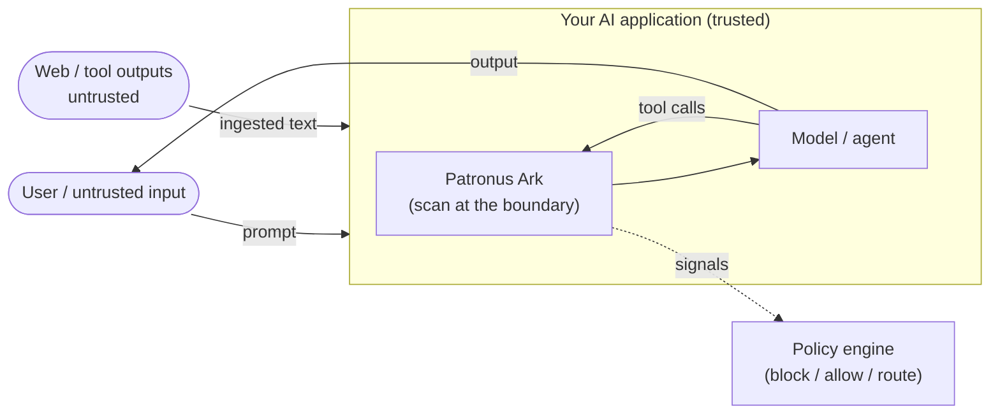

# Threat model

This page states what Patronus Ark is designed to defend against, what it explicitly does
**not** guarantee, the trust boundaries it sits on, and the assumptions it makes. It follows
the spirit of the [OWASP Threat Model](https://owasp.org/www-project-threat-model-library/)
approach: name the assets, the boundaries, and the limits honestly.

!!! warning "Patronus Ark is a detector, not a guarantee"
    It is a probabilistic risk **classifier** that raises signals for a policy engine to act
    on. It reduces risk; it does not eliminate it. No classifier catches every attack, and a
    positive result is a *signal*, not proof. Treat it as one control in a defense-in-depth
    stack, never the only one.

## What it protects

The asset being protected is the **integrity and confidentiality of an AI application's
interactions**: the prompts sent to a model, the tool calls an agent makes, the tool outputs
it ingests, and the documents that pass through it.

Concretely, the library provides signals to:

- detect **prompt injection and jailbreaks** before untrusted text reaches the model
  (`injection`, `threat`);
- detect **PII, secrets, and DLP-relevant content** leaving or entering the boundary
  (`pii`, `dynamic-pii`, `dlp`, `sensitive_document`);
- classify **agentic tool use** so a policy engine can gate risky actions
  (`tool_class`, `tool_action`, `tool_tags`, `routing`).

## Trust boundaries

Patronus Ark is meant to run **on the endpoint**, in the request path between components
that do not fully trust each other:

The primary boundaries to scan at:

1. **Untrusted input → model.** User prompts and any externally-controlled text (web pages,
   documents, upstream API responses) before they reach the model.
2. **Tool output → agent.** Tool results an agent ingests — a classic injection vector.
3. **Model/agent → outside.** Content or tool calls leaving the boundary (DLP, exfiltration).

Scanning is **local**: no scan content crosses a network boundary. The only outbound network
activity is the optional, one-time download of model assets from Hugging Face.

## Assumptions

- **The host is trusted.** The library trusts the process and machine it runs in. It does not
  defend against a compromised host, a malicious operator, or tampering with its own binaries
  or cached model files.
- **Assets are authentic.** The L2 NTDB packages, L3 transformers, the unified L3 model, and the
  dynamic-pii bundle are fetched from **immutable, pinned commit revisions** (SHAs) recorded in
  [`specs.rs`](https://github.com/patronus-protect/patronus-security/blob/main/rust/src/assets/specs.rs).
  The download step does not re-verify file bytes against a separate published content hash.
- **The caller acts on the signals.** The library classifies; enforcement (blocking, routing,
  approval) is the caller's responsibility. A signal nobody acts on protects nothing.
- **Scanned text is the actual text.** If content is decrypted, decoded, or assembled *after*
  the scan point, scan it again at the point it becomes effective.

## What it does NOT defend against

- **Guaranteed detection.** False negatives are possible, especially for novel or heavily
  obfuscated attacks. L1 rules can be evaded by obfuscation the rules do not model; the L2/L3
  models — trained with obfuscation augmentation — are the intended backstop, but are still
  probabilistic.
- **False positives.** Benign text can be flagged. High-impact enforcement should use
  calibrated thresholds and, where possible, human review.
- **Semantic attacks with no surface signal.** Attacks that are individually benign and only
  harmful in a broader context the scanner cannot see.
- **Information flow across steps.** The scanner classifies one text at a time; it does not
  track data flow or state across a multi-step agent trajectory.
- **Downstream vulnerabilities.** SQL injection, SSRF, RCE, insecure tool implementations, and
  other application bugs. Patronus flags *risky text*; it does not sandbox tool execution.
- **Denial of service.** Extremely large or pathological inputs are bounded (text limits,
  windowing, timeouts) so the scanner degrades gracefully, but the library is not a rate
  limiter or a DoS defense for your application.
- **Languages it was not trained/tuned for.** German and English are the primary evaluated
  languages; other languages run through the multilingual backbones but were not actively
  validated.

## Failure behavior is fail-*open* on the scan, fail-*safe* on the verdict

If a model asset is missing or an L3 inference errors or times out, the scan **does not throw**
— it [degrades](layered-scanning.md#degradation-contract) to the best available lower-layer
result and reports a structured failure. This means a broken L3 does not take your application
down, but it also means **you must decide your policy for degraded verdicts**: if `threat` can
only answer at L1 because its model is missing, is that acceptable for your risk posture? Check
`runtime_readiness()` / `asset_readiness()` and the failure entries on terminal events.

## Using it correctly (defense in depth)

- Scan at **every** untrusted boundary, including tool outputs — not just the initial prompt.
- Combine model signals with **deterministic policy** (allow-lists, capability gates) for
  high-impact actions.
- Choose an [operating point](../reference/configuration.md#ntdb-operating-point) that matches
  your tolerance for false positives vs. false negatives.
- Re-scan content that is transformed after the first scan point.
- Monitor degraded verdicts and asset readiness in production.

## Reporting a vulnerability

Security issues in the library itself are handled under the
[Security policy](../security.md). Please do not open public issues for undisclosed
vulnerabilities.
